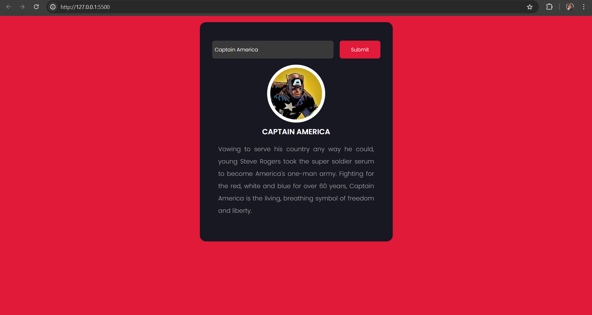
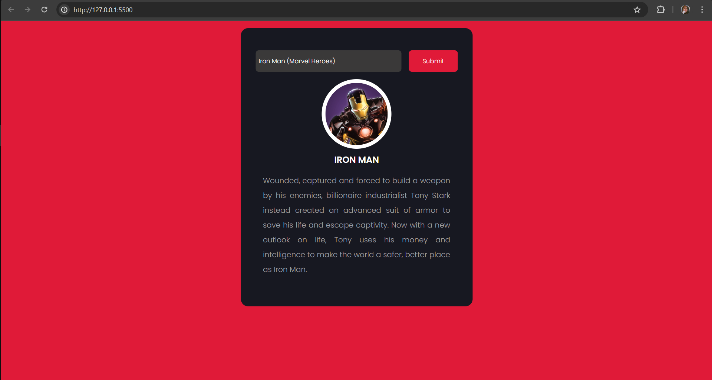

# MARVEL_API_APP
Assemble your knowledge of the Marvel Universe with this JavaScript Marvel API App! Dive deep into the world of your favorite superheroes.

# Getting Started:
1. Clone this repository.
2. To run this project you have to create your own key for public as well as private from the marvel api website.
3. After that go to md5 hash generator website  for creating hash value.
4. copy the timestamp, private key, public key and paste it into the md5 hash generator website.
5. Now copy the hash value and paste it in the api-data.js file.

   
